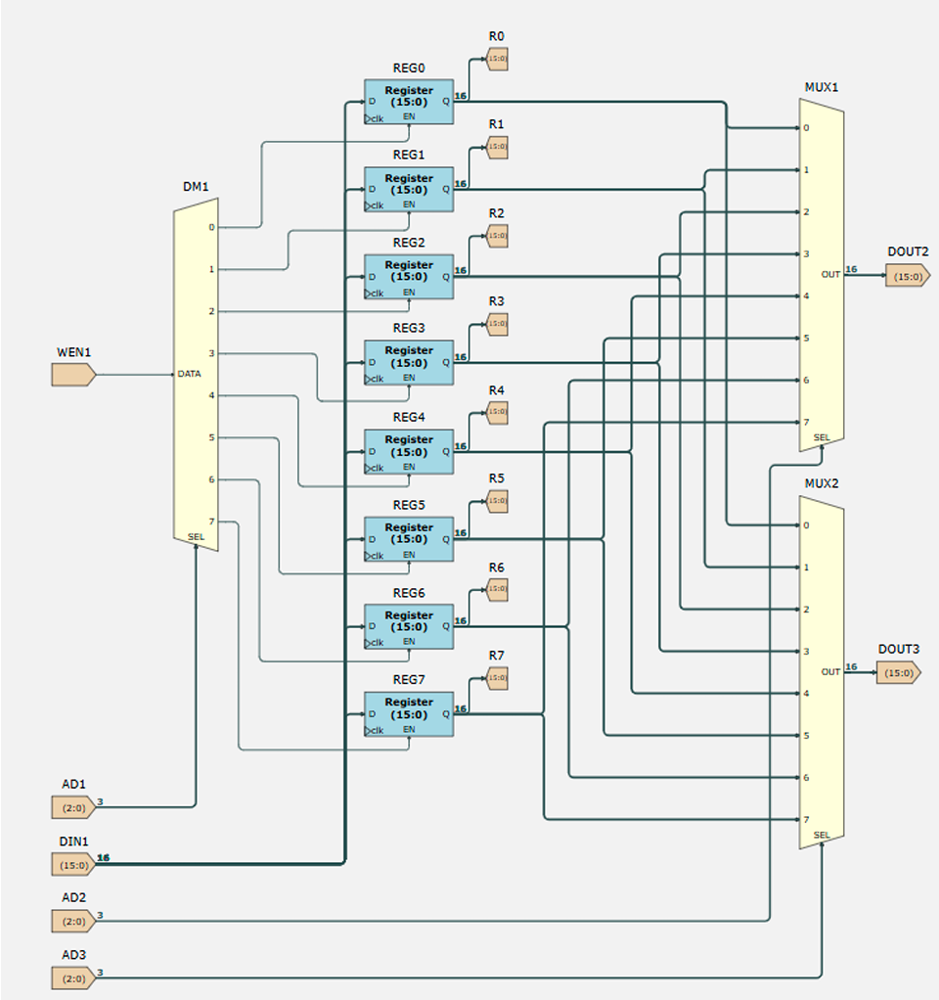
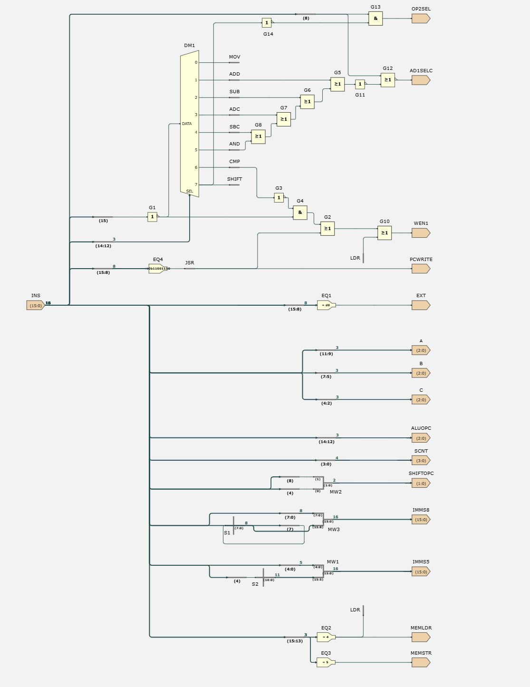
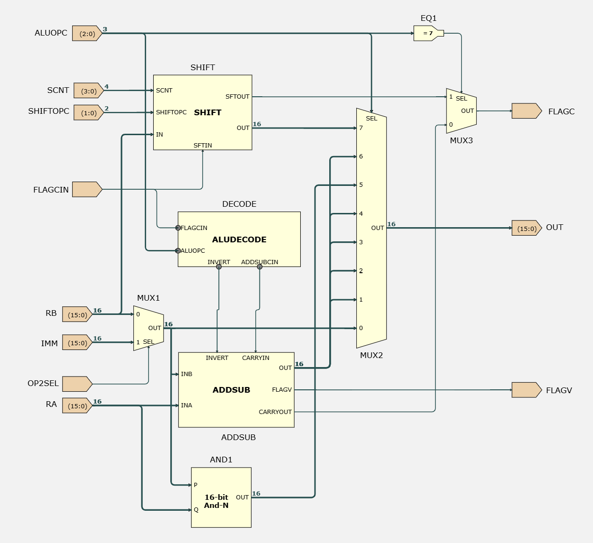
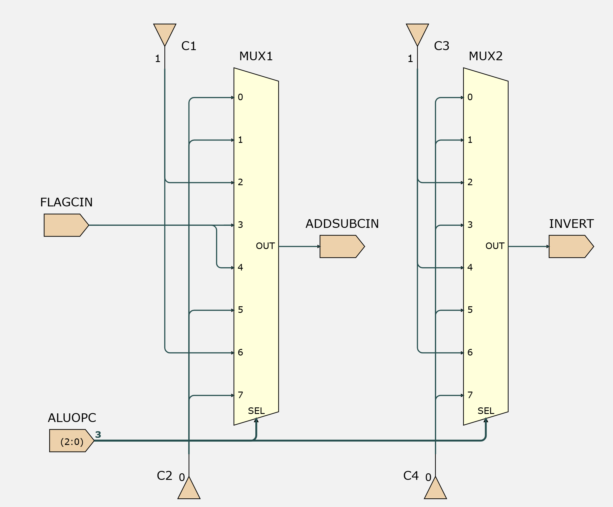
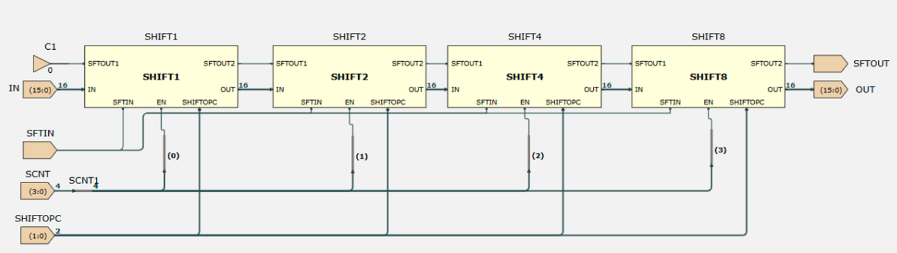
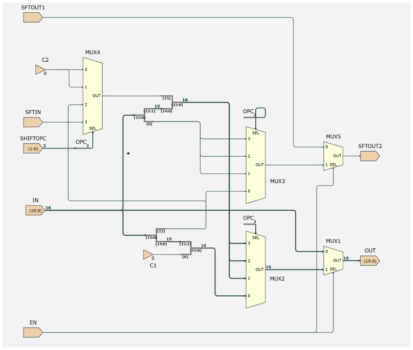

# EEP1 CPU Datapath in Verilog

A Verilog implementation of the datapath of **EEP1**, a 16-bit RISC CPU used in the Digital Electronics and Computer Architecture course at Imperial College London.

In the lab, I worked with the EEP1 datapath as a schematic in Issie. In this project I rebuilt it as a hardware description in Verilog, keeping the same block structure, and verified it with self-checking testbenches.

## Results

| Testbench | What it tests | Result |
|---|---|---|
| `tb_alu.v` | 100,000 randomised ALU tests against an independent reference model | **0 mismatches** |
| `tb_regfile.v` | Reset, write/read-back, write-enable, dual read ports | **PASS** (7 checks) |
| `tb_datapath.v` | 4 EEP1 machine-code programs, including 32-bit addition | **PASS** (14 checks) |

---

## Contents

1. [The EEP1 CPU](#1-the-eep1-cpu)
2. [Instruction set](#2-instruction-set)
3. [What this project implements](#3-what-this-project-implements)
4. [Design: module by module](#4-design-module-by-module)
5. [Verification](#5-verification)
6. [Running it](#6-running-it)
7. [Repository structure](#7-repository-structure)
8. [Next steps](#8-next-steps)

---

## 1. The EEP1 CPU

EEP1 is a teaching CPU designed around the same principles as Arm processors.

| Feature | EEP1 |
|---|---|
| Word size | 16 bits (data, registers and instructions) |
| Architecture | **Harvard**: separate memories for code and data |
| Instruction style | **RISC**: simple, regular instructions |
| Execution | **Single-cycle**: every instruction completes in one clock cycle |
| Registers | 8 general-purpose registers, R0–R7 |
| Memory access | **Load/store**: only `LDR`/`STR` touch memory; everything else works on registers |
| Condition flags | N (negative), Z (zero), C (carry), V (signed overflow) |
| Reset state | All registers and flags start at 0 |

**RISC vs CISC.** In a RISC design every instruction does one simple job, such as one add or one load. That makes the hardware simpler and lets each instruction finish in a single cycle. CISC designs (like x86) have complex instructions that can, for example, read memory and do arithmetic at once.

**Harvard architecture.** Instructions and data sit in separate memories with separate buses, so the CPU can fetch an instruction and access data in the same cycle.

**A CPU has two halves:**
- The **datapath** moves and transforms data: the register file, ALU and the decoder that steers them. **This is what this project implements.**
- The **control path** decides which instruction runs next: the program counter and jump logic.

---

## 2. Instruction set

Every EEP1 instruction is 16 bits. The top bits select the instruction type:

| Bits 15–12 | Type |
|---|---|
| `0xxx` | ALU instruction |
| `10xx` | Load / store |
| `1100` | Jump |
| `1101` | EXT (extend the next instruction's immediate to 16 bits) |

### ALU instruction formats

```
 bit:     15 | 14 13 12 | 11 10 9 |  8   | 7 6 5 |  4   | 3 2 1 0
 reg-reg:  0 |  ALUOPC  |    a    |  0   |   b   |    c       | 0 0
 reg-imm:  0 |  ALUOPC  |    a    |  1   |      Imms8 (IMM)
 shift:    0 |    7     |    a    | sop1 |   b   | sop0 |  SCNT
```

- `a`, `b`, `c` are 3-bit register numbers (Ra, Rb, Rc).
- `Imms8` is an 8-bit **signed** immediate (−128 to 127), sign-extended to 16 bits.
- For shifts, the 2-bit shift opcode is split across bits 8 and 4, and `SCNT` is a 4-bit shift amount (0–15).

### ALU operations

| ALUOPC | Instruction | Register form | Immediate form | Result | Writes to | Flags written |
|---|---|---|---|---|---|---|
| 0 | MOV | `MOV Ra, Rb` | `MOV Ra, #IMM` | B | Ra | N, Z |
| 1 | ADD | `ADD Rc, Ra, Rb` | `ADD Ra, #IMM` | Ra + B | Rc (Ra if imm) | N, Z, C, V |
| 2 | SUB | `SUB Rc, Ra, Rb` | `SUB Ra, #IMM` | Ra − B | Rc (Ra if imm) | N, Z, C, V |
| 3 | ADC | `ADC Rc, Ra, Rb` | `ADC Ra, #IMM` | Ra + B + C | Rc (Ra if imm) | N, Z, C, V |
| 4 | SBC | `SBC Rc, Ra, Rb` | `SBC Ra, #IMM` | Ra − B + (C − 1) | Rc (Ra if imm) | N, Z, C, V |
| 5 | AND | `AND Rc, Ra, Rb` | `AND Ra, #IMM` | Ra & B | Rc (Ra if imm) | N, Z |
| 6 | CMP | `CMP Ra, Rb` | `CMP Ra, #IMM` | Ra − B | *nothing* | N, Z, C, V |
| 7 | SHIFT | `LSL/LSR/ASR/XSR Ra, Rb, #SCNT` | — | Rb shifted | Ra | N, Z, C (last bit out) |

B is either Rb or the sign-extended immediate.

### Shift types

| SHIFTOPC | Shift | Fills with | Use |
|---|---|---|---|
| 0 | LSL | 0 | Multiply by 2ⁿ |
| 1 | LSR | 0 | Unsigned divide by 2ⁿ |
| 2 | ASR | the sign bit | Signed divide by 2ⁿ (negative numbers stay negative) |
| 3 | XSR | the carry flag | Shifting numbers that span several registers |

### Flags

| Flag | Meaning | Set when |
|---|---|---|
| N | Negative | Result bit 15 is 1 |
| Z | Zero | Result is 0 |
| C | Carry | Carry out of the adder (for subtraction: 1 = no borrow, i.e. Ra ≥ B unsigned), or the last bit shifted out |
| V | Overflow | A signed result didn't fit in −32768..32767 |

Flags are only changed by ALU instructions. ADC and SBC **read** the carry flag, which is what allows arithmetic on numbers wider than 16 bits.

### Other instruction types (control path, not implemented here)

| Type | Examples | What it does |
|---|---|---|
| Load / store | `LDR Ra, [Rb, #Imms5]`, `STR Ra, [#Imms8]` | Read or write data memory |
| Jump | `JMP`, `JEQ`, `JNE`, `JGT`, `JSR`, `RET`, … | Change the program counter, conditionally on the flags |
| EXT | `EXT #0x23` | Supply the top 8 bits of the next instruction's immediate |

---

## 3. What this project implements

The complete EEP1 **datapath** for all ALU instructions:

```
                ins
                 |
                 v
            +----------+   a, b, c, IMM, ALUOPC, SHIFTOPC, SCNT
            | DPDECODE |   op2sel, ad1sel, wen1, flag enables
            +----------+
                 |
   AD1 = ad1sel ? c : a
                 |
                 v
            +----------+  DOUT2 (Ra) -----------------------> ALU.INA
  DIN1 ---->| REGFILE  |                                             +-----+
     ^      |  R0..R7  |  DOUT3 (Rb) --+                             | ALU | --> OUT
     |      +----------+               +--[ op2sel mux ]--> ALU.INB  +-----+     |
     |                     IMM --------+                                 |       |
     |                                                          C, V     |       |
     |                                                  N, Z, C, V flags <+       |
     +-----------------------------------------------------------------------------+
                                   result written back
```

**One instruction, one cycle.** Take `ADD R3, R0, R1`:

1. **Decode:** DPDECODE splits the instruction into a = R0, b = R1, c = R3, ALUOPC = ADD.
2. **Read:** the register file outputs R0 and R1 straight away (combinational read).
3. **Select:** `op2sel = 0`, so the ALU's second input is R1 rather than an immediate.
4. **Compute:** the ALU adds them (combinational).
5. **Write back:** on the **rising clock edge**, the result is stored in R3 (`ad1sel = 1` selects field c) and the flags update.

Everything except the final write is combinational, which is why a register's new value appears one clock edge after the instruction that writes it.

The instruction memory and program counter belong to the control path, so here the testbench feeds instructions in directly, one per clock cycle.

---

## 4. Design: module by module

Each Verilog module corresponds to a sheet in the Issie schematic design used in the lab. The schematic for each block is shown alongside its Verilog description.

```
datapath.v            top level
├── dpdecode.v        instruction decoder
├── regfile.v         R0..R7
└── alu.v             ALU
    ├── aludecode.v     ALU decoder
    ├── addsub.v        adder / subtractor
    └── shifter.v       barrel shifter
        └── shiftn.v      one shifter stage (used 4 times)
```

### `regfile.v`: the register file



- 8 registers × 16 bits = 128 D flip-flops (`REG0`–`REG7`).
- **One write port** (`AD1`, `DIN1`, `WEN1`), clocked: a register only changes on the rising clock edge, and only if its enable is 1.
- **Two read ports** (`AD2 → DOUT2`, `AD3 → DOUT3`), combinational. Two ports are needed so instructions like `ADD Rc, Ra, Rb` can read both operands in one cycle.

| Schematic | Verilog |
|---|---|
| `REG0`–`REG7` (16-bit registers with enable) | `reg [15:0] r0 ... r7;` updated in `always @(posedge clk)` |
| Demultiplexer `DM1`: `WEN1` on DATA, `AD1` on SEL, one output per register enable | `we = wen1 ? (8'b1 << ad1) : 8'b0;` |
| 8-to-1 multiplexers `MUX1` (SEL = `AD2`) and `MUX2` (SEL = `AD3`) | Two `assign dout2 = ...` / `assign dout3 = ...` multiplexer chains |

### `dpdecode.v`: the instruction decoder



Splits the instruction into fields (pure wiring) and generates the control signals:

| Signal | Meaning | Logic |
|---|---|---|
| `op2sel` | ALU's second operand is the immediate | bit 8 = 1, except for shifts (where bit 8 is part of SHIFTOPC) |
| `ad1sel` | Write to Rc instead of Ra | register form (bit 8 = 0) of ADD, SUB, ADC, SBC, AND |
| `wen1` | Write the result to a register | every ALU instruction **except CMP** |
| `wen_nz` | Update N and Z | every ALU instruction |
| `wen_cv` | Update C and V | every ALU instruction except MOV and AND |

**How the schematic maps to the Verilog:**
- **Opcode decoding:** demultiplexer `DM1` turns ALUOPC (bits 14:12) into one wire per instruction, enabled only when bit 15 = 0 (gate `G1`). In Verilog this is done with comparisons such as `aluopc == 3'd6`.
- **`OP2SEL`** = bit 8 AND NOT SHIFT (gates `G14`, `G13`), the same logic as the Verilog.
- **`AD1SELC`**: the OR chain `G5`–`G8` detects ADD/SUB/ADC/SBC/AND. The schematic signal has the opposite polarity to `ad1sel` in this project (it selects field a when 1), but the logic is equivalent.
- **`WEN1`** = ALU instruction AND NOT CMP (`G3`, `G4`). In the schematic it is also ORed with `JSR` and `LDR` (`G2`, `G10`), which belong to the control path and memory instructions not implemented here.
- **Sign extension:** `MW3` joins bits 7:0 with bit 7 copied into the top 8 bits, the same as `{{8{ins[7]}}, ins[7:0]}`.
- **`EXT`, `IMMS5`, `MEMLDR`, `MEMSTR` and `PCWRITE`** drive the control path and data memory, so they are not part of this project.

**CMP vs SUB:** both do exactly the same subtraction. CMP sets `wen1 = 0`, so the result is discarded and only the flags change.

### `alu.v`: the ALU



Contains the decoder, adder, 16-bit AND and barrel shifter. All four blocks compute in parallel every cycle, and an 8-to-1 output multiplexer (`MUX2`, selected by ALUOPC) picks the result:

| ALUOPC | Output from |
|---|---|
| 0 (MOV) | second operand, passed through |
| 1, 2, 3, 4, 6 | adder / subtractor |
| 5 (AND) | AND gates |
| 7 (SHIFT) | barrel shifter |

- **Carry flag:** `MUX3` takes the carry from the shifter when ALUOPC = 7 (`EQ1`), otherwise from the adder.
- **Overflow flag:** comes straight from the adder.
- **Operand select:** in the schematic the Rb/immediate multiplexer (`MUX1`, `OP2SEL`) sits inside the ALU. In this project it sits in `datapath.v` instead, so the ALU receives a single second operand. The behaviour is the same.
- The shifter always shifts Rb, not the immediate.

CMP is identical to SUB inside the ALU. The difference is in the decoder.

### `aludecode.v`: controls the adder



The schematic is two 8-input lookup multiplexers with constant inputs (0, 1 or FLAGCIN), both selected by ALUOPC:

| ALUOPC | Instruction | INVERT | ADDSUBCIN | Adder computes |
|---|---|---|---|---|
| 1 | ADD | 0 | 0 | a + b |
| 2 | SUB | 1 | 1 | a + ~b + 1 = a − b |
| 3 | ADC | 0 | FLAGCIN | a + b + C |
| 4 | SBC | 1 | FLAGCIN | a + ~b + C = a − b + (C − 1) |
| 6 | CMP | 1 | 1 | a − b |
| 0, 5, 7 | MOV, AND, SHIFT | 0 | 0 | don't care: the adder output is not selected |

The Verilog implements the same truth table.

### `addsub.v`: one adder for five instructions

Computes `INA + (INVERT ? ~INB : INB) + CARRYIN`.

In two's complement, −b = ~b + 1, so subtraction is just addition with b inverted and a carry-in of 1. This lets ADD, SUB, ADC, SBC and CMP share a single adder.

- The sum is 17 bits wide, so the carry out of bit 15 lands in bit 16.
- **Overflow:** if both adder inputs have the same sign but the result's sign differs, the true answer didn't fit (e.g. `0x7FFF + 1 = 0x8000`).

### `shifter.v`: the barrel shifter



Four stages in series that shift by 1, 2, 4 and 8. Each is enabled by one bit of SCNT, so any shift from 0 to 15 takes **one cycle** and only **four levels of logic**:

```
SCNT = 5 = 0101b   ->   SHIFT1 on, SHIFT2 off, SHIFT4 on, SHIFT8 off   ->   1 + 4 = 5 bits
```

Using 15 single-bit stages instead would need 15 levels of logic. The carry (`SFTOUT`) is chained from stage to stage, so the final carry out is the last bit shifted out overall.

In the schematic these are four separate sheets. In Verilog, one module (`shiftn.v`) is written once with a `parameter N` and instantiated four times with N = 1, 2, 4 and 8.

### `shiftn.v`: one shifter stage



When `EN = 0` the stage passes its input and carry straight through (`MUX1`, `MUX5`). When `EN = 1` it shifts by N bits:

| SHIFTOPC | Shift | Direction | Bit shifted in (`MUX4`) |
|---|---|---|---|
| 0 | LSL | left | 0 |
| 1 | LSR | right | 0 |
| 2 | ASR | right | the sign bit, so negative numbers stay negative |
| 3 | XSR | right | the carry (`SFTIN`) |

`MUX2` selects the shifted word and `MUX3` selects the bit that falls off the end, which becomes the carry out.

**Differences from the schematic:**
- **XSR fill bit:** in the schematic, `SFTIN` (the original carry flag) is wired to all four stages, so every shifted-in bit is the carry flag. In this Verilog version, each stage fills with its own carry-in, which after an earlier active stage is the bit that stage shifted out. Both behave identically for a 1-bit shift, which is how XSR is used for multi-word shifts, and the ALU test does not check XSR shifts of more than 1 bit.
- **Shift by 0:** the schematic starts the carry chain at constant 0, so a shift by 0 produces carry 0. This Verilog version leaves the carry flag unchanged when nothing is shifted out.

In both designs XSR is only meaningful as a 1-bit shift: a single carry bit cannot supply the several bits a longer multi-word shift would need.

### `datapath.v`: the top level

Connects the decoder, register file and ALU with two multiplexers (`op2sel` and `ad1sel`), and holds the four flag flip-flops. The carry flag is fed back into the ALU, so an ADC can use the carry produced by the instruction before it.

### Verilog concepts used

| Hardware (Issie) | Verilog |
|---|---|
| A schematic sheet | `module ... endmodule` |
| Placing a sub-sheet | Module instantiation, e.g. `addsub ADDSUB ( ... );` |
| Wire / bus | `wire [15:0] name;` |
| Gates, multiplexers, adders | `assign` or `always @(*)` (combinational) |
| D flip-flops | `always @(posedge clk)` with non-blocking `<=` |
| Four near-identical sheets | One module with a `parameter` |
| Bus splitting and joining | Bit slices `ins[11:9]`, concatenation `{a, b}`, replication `{8{x}}` |

`` `default_nettype none `` is used in every design file, so a misspelt wire name becomes a compile error instead of silently creating a new, unconnected wire.

---

## 5. Verification

All testbenches are **self-checking**: they compare outputs against expected values and report PASS/FAIL themselves, rather than relying on reading waveforms by eye.

### `tb_alu.v`: randomised testing against a reference model

```
repeat 100,000 times:
    1. pick random inputs (biased towards edge cases)
    2. wait for the ALU to settle
    3. compute the expected result with a reference model
    4. compare result, carry and overflow; count mismatches
```

- **Edge-case bias:** 5 out of 8 random values are forced to `0x0000`, `0x0001`, `0x7FFF`, `0x8000` or `0xFFFF`, where carry and overflow bugs hide. Purely random 16-bit values almost never hit these.
- **Independent reference model:** expected results are computed with ordinary integer arithmetic rather than hardware tricks. For example, the hardware detects overflow from sign bits, while the reference simply checks whether the true answer lies outside −32768..32767. Because the two use different methods, a mistake in one is very unlikely to be repeated in the other.
- **Fixed seed:** the random sequence is repeatable, so any failure can be reproduced exactly.

**Result:**

```
========== EEP1 ALU random test ==========
 Tests run : 100000
 MOV 12504 | ADD 12637 | SUB 12466 | ADC 12546 | SBC 12572 | AND 12348 | CMP 12447 | SHIFT 12480
 XSR > 1 not checked: 2778
 Mismatches: 0
 RESULT: PASS
==========================================
```

The 2,778 XSR shifts of more than one bit are excluded from checking, because XSR is only meaningful as a 1-bit shift (see `shiftn.v` above).

### `tb_regfile.v`: register file

Uses a generated clock, changing inputs on the falling edge so they are stable when the register file samples on the rising edge. It checks:

1. All registers are 0 after reset.
2. Written values read back correctly, and other registers are unaffected.
3. Nothing is written when `WEN1 = 0` (the mechanism CMP relies on).
4. Both read ports work at the same time.

### `tb_datapath.v`: real EEP1 programs

Feeds machine code into the datapath one instruction per clock cycle, prints the registers and flags each cycle, and checks the final state.

| Program | Instructions | Checks |
|---|---|---|
| MOV/ADD (lab Task 3) | `MOV R0,#3` · `MOV R1,R0` · `ADD R1,#1` · `ADD R3,R0,R1` | R0 = 3, R1 = 4, R3 = 7 |
| Sum four registers (lab challenge) | 4 × `MOV`, 3 × `ADD` | R4 = 0xFFEF (−17) |
| 32-bit addition | `ADD R4,R0,R2` then `ADC R5,R1,R3` | 0x0000FFFF + 1 = 0x00010000 |
| AND / LSL / CMP | `AND R3,R0,R1` · `LSL R2,R1,#3` · `CMP R0,R1` | R3 = 5, R2 = 0x38, R0 unchanged, NZCV = 1000 |

Two details these programs show:

- **`MOV R2, #233` loads −23, not 233.** Immediates are signed 8-bit, so 233 (`0xE9`) is sign-extended to `0xFFE9`.
- **32-bit arithmetic on a 16-bit CPU:** `ADD` on the low halves sets the carry flag, and `ADC` on the high halves adds it in on the next cycle.

---

## 6. Running it

Requires [Icarus Verilog](https://bleyer.org/icarus/). Waveforms (`.vcd` files) can be viewed with GTKWave or the WaveTrace extension for VS Code.

```bash
# ALU: 100,000 randomised tests
iverilog -o alu_test src/addsub.v src/aludecode.v src/shiftn.v src/shifter.v src/alu.v tb/tb_alu.v
vvp alu_test

# Register file
iverilog -o reg_test src/regfile.v tb/tb_regfile.v
vvp reg_test

# Datapath: EEP1 programs
iverilog -o dp_test src/addsub.v src/aludecode.v src/shiftn.v src/shifter.v src/alu.v src/regfile.v src/dpdecode.v src/datapath.v tb/tb_datapath.v
vvp dp_test
```

`tb_datapath.v` writes `datapath.vcd`, which shows every register and flag changing cycle by cycle.

---

## 7. Repository structure

```
.
├── src/
│   ├── addsub.v        adder / subtractor
│   ├── aludecode.v     ALU decoder
│   ├── shiftn.v        one barrel shifter stage
│   ├── shifter.v       4-stage barrel shifter
│   ├── alu.v           ALU
│   ├── regfile.v       register file R0..R7
│   ├── dpdecode.v      instruction decoder
│   └── datapath.v      top level
├── tb/
│   ├── tb_alu.v        randomised ALU test
│   ├── tb_regfile.v    register file test
│   └── tb_datapath.v   machine-code program tests
├── images/             Issie schematics of each block
└── README.md
```

---

## 8. Next steps

- **Control path:** program counter, jump-condition logic, `JSR`/`RET` subroutines, `EXT`, `LDR`/`STR` and the code and data memories, completing the full CPU.
- **Hardware multiply:** add a `MUL` instruction using an unused opcode and measure the cycle saving against a software multiply loop.
- **Random program testing:** generate random instruction sequences and compare every register, every cycle, against an instruction-level reference model.
- **Synthesis:** run the design through Yosys to measure FPGA resource usage per block.
